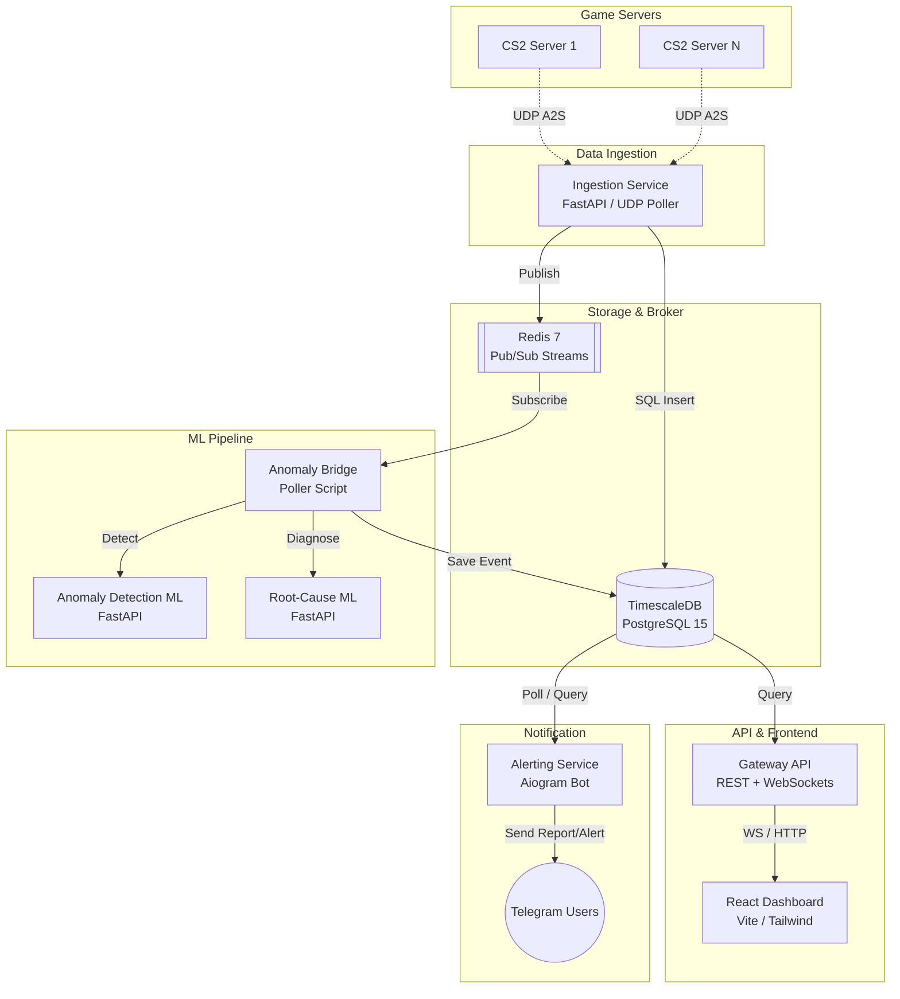

# 🎮 Game Server Health & Anomaly Monitor (GSH)

**Real-time, ML-powered monitoring and anomaly detection platform for multiplayer game servers.** 

GSH collects live server status, player counts, latency (ping), and events, stores massive time-series data in **TimescaleDB**, streams metrics via **Redis Streams**, applies real-time **Machine Learning** to detect and classify anomalies, and provides a powerful **React Dashboard** alongside an automated **Telegram Alerting Bot**.

> **Current Status:** Fully operational for CS2. The ingestion pipeline actively monitors 28 real CS2 servers across Eastern/Central Europe (Vienna, Warsaw, EU-East) via Valve's UDP A2S protocol. The ML pipeline detects baseline deviations and classifies root causes (e.g., `REGIONAL_OUTAGE`, `HIGH_LATENCY`). The Telegram bot sends instant anomaly alerts and daily HTML/JSON analytical reports.

---

## Key Features

- **Live UDP Polling:** Concurrent, non-blocking UDP A2S queries to game servers with automatic timeout handling.
- **Time-Series Engine:** High-performance metric storage using PostgreSQL + TimescaleDB hypertables.
- **Event-Driven ML Pipeline:** Redis Streams (`server_metrics_stream`) feed live data to an Anomaly Detection ML model (Rolling Z-Score) and a Root-Cause Classifier.
- **Smart Telegram Alerting:** 
  - Instant notifications for anomalies with AI-diagnosed root causes (`#event`).
  - Automated Daily Analytics HTML Reports with performance leaderboards (`#daily_report`).
  - On-demand historical queries via chat (e.g., `@bot 2026.08.30`).
- **Interactive React Dashboard:** Modern UI (React 18 + Vite) featuring WebSocket live feeds, KPI cards, paginated insights, historical calendars, and Dark Mode.

---

## System Architecture & Microservices

GSH is built as a highly decoupled microservices architecture, utilizing Docker for orchestration.



### Directory Layout

| Service / Directory | Description | Stack |
|:---|:---|:---|
| `/ingestion-service` | Asynchronously queries servers via UDP A2S every 3s, writes to Timescale, publishes to Redis. | FastAPI, Python A2S |
| `/anomaly-detection-ml` | ML model assessing dynamic server baselines (Z-Scores) to detect latency or player anomalies. | FastAPI, Scikit-learn |
| `/root-cause-ml` | ML classifier determining if an anomaly is a Server Crash, DDoS, or Regional Outage. | FastAPI, Scikit-learn |
| `/anomaly-bridge` | Acts as the glue: subscribes to Redis Streams, triggers ML models, and saves diagnosed events. | Python, Redis-py |
| `/gateway-api` | Main backend API providing REST data to the frontend and broadcasting WebSocket updates. | FastAPI, Asyncpg |
| `/client` | The interactive frontend UI with KPI grids, Recharts, dark mode, and server metrics. | React, Vite, Tailwind |
| `/alerting-service` | APScheduler & Aiogram bot sending instant anomaly alerts and daily HTML analytical reports. | Aiogram 3, Asyncpg |
| `/shared_schemas` | Pydantic v2 schemas used across all Python microservices for strict data validation. | Pydantic |

---

## 🚀 Getting Started

### 1. Prerequisites
- Docker and Docker Compose (v2)
- Node.js 18+ (if running the frontend locally)
- Python 3.10+ (if running backend services locally)
- A Telegram Bot Token (from [@BotFather](https://t.me/BotFather)) and a Chat/Group ID.

### 2. Environment Configuration
Create a `.env` file in the root directory based on `.env.example`:

```bash
cp .env.example .env
```
Ensure you fill in the Telegram Bot credentials inside the `.env` file to enable the Alerting Service:
```env
TELEGRAM_BOT_TOKEN="your_telegram_bot_token"
TELEGRAM_CHAT_ID="-100xxxxxxxxx"
SCHEDULER_MODE="daily"
SEND_ON_STARTUP="true"
```

### 3. Run Production Stack (Docker)
To spin up the entire architecture (Databases, ML Models, APIs, Bot, and Ingestion):

```bash
docker-compose up -d --build
```

### 4. Verify Services
- **React Dashboard:** [http://localhost:3000](http://localhost:3000)
- **Gateway API Docs:** [http://localhost:8000/docs](http://localhost:8000/docs)
- **Ingestion API Docs:** [http://localhost:8001/docs](http://localhost:8001/docs)

*(Note: The Telegram Bot will instantly send an initialization message to your configured group if `SEND_ON_STARTUP=true`).*

---

## Dashboard Modules Explained

1. **Overview:** The primary command center. Displays top-level KPIs (Online/Offline ratio, Health Score), a 9-grid view of server cards, live interactive Timescale charts, and an event feed timeline.
2. **Server Fleet:** A detailed, filterable, and paginated table of all registered servers, displaying exact geographic regions, IP addresses, and current status.
3. **Event Logs:** A raw log viewer for all detected anomalies, crashes, and recoveries fetched directly from `server_events`.
4. **Timescale Analytics:** Time-bucketed aggregates showing performance metrics over a selected timeframe (e.g., 10-minute intervals).
5. **Daily Insights (Report Viewer):** A beautiful, standalone reporting interface allowing administrators to select a historical date from a calendar and view that day's generated JSON/HTML analytical report directly in the UI.

---

## 🤖 Telegram Bot Commands & Alerts

The integrated Aiogram bot operates automatically in the background, but also listens for user interactions:

- **Instant Anomalies (`#event`):** Whenever the `root-cause-ml` service diagnoses a severe issue (e.g., `REGIONAL_OUTAGE`), the bot instantly posts a detailed alert containing the server IP, the diagnosed root cause, confidence score, and recommended actions.
- **Daily Analytics (`#daily_report`):** At a scheduled UTC time, the bot compiles 24 hours of data into a stylized HTML file and sends it to the group. It includes metrics like "Most Unstable Server", "Top 3 Best Ping Servers", and "Total Busiest Servers".
- **Historical Query:** Mention the bot with a date to retrieve a cached report.
  ```text
  @your_bot_username 2026.08.30
  ```

---

## Roadmap

- [x] Shared Pydantic data schemas for microservice reliability
- [x] TimescaleDB time-series storage and hypertable indexing
- [x] Live CS2 asynchronous UDP A2S poller (Vienna, Warsaw, EU-East)
- [x] Redis Streams message broker integration (`server_metrics_stream`)
- [x] Real-time FastAPI WebSocket gateway
- [x] Full-featured React dashboard with live charts, filters, and Dark Mode
- [x] Anomaly Detection Service (Rolling Z-Score Baseline)
- [x] Root-Cause Classification Service (ML diagnosis pipeline)
- [x] Telegram Bot Alerting Service with HTML scheduled reports
- [x] JSON caching for Daily Reports UI integration
- [ ] Dota 2 (OpenDota / Steam API) live ingestion support
- [ ] PUBG API rate-limited shard polling

---

## License
This project is proprietary and built for Game Server Health (GSH) monitoring.
