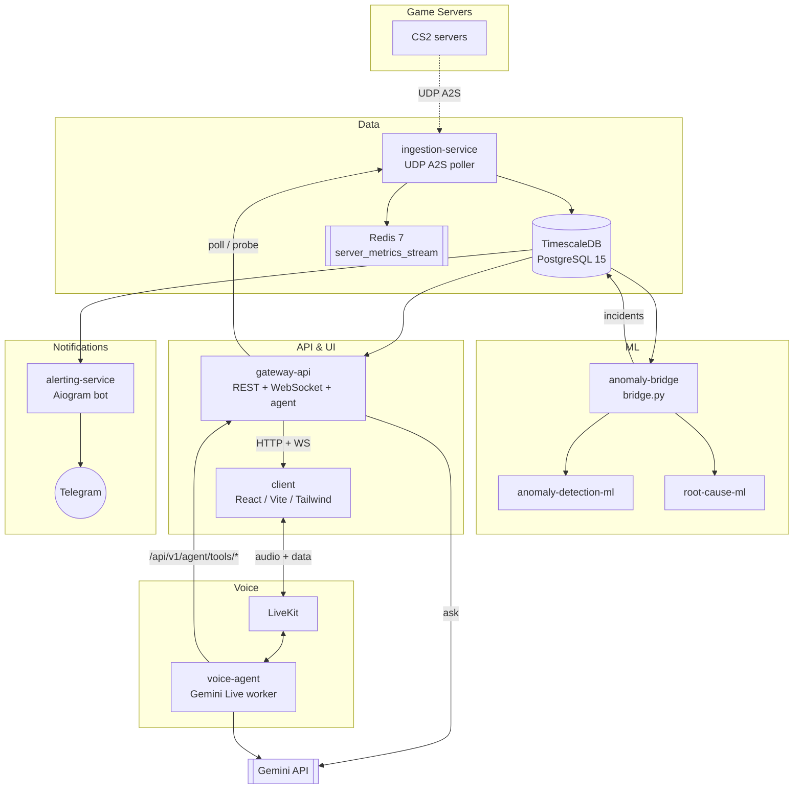

# 🎮 Game Server Health & Anomaly Monitor (GSH)

**Real-time monitoring, anomaly detection and an AI assistant for multiplayer game servers.**

GSH polls live game servers over Valve's UDP A2S protocol, stores the
time series in **TimescaleDB**, runs **ML** anomaly detection and root-cause
classification on it, and surfaces everything in a **React dashboard**, a
**Telegram bot**, and an **AI agent you can type to or talk to**.

> **Status:** running for CS2. The ingestion service monitors the fleet
> registered in `monitored_servers` (a couple of dozen real servers across
> Central and Eastern Europe — add or remove them from the admin console).
> The ML pipeline flags baseline deviations and labels root causes such as
> `REGIONAL_OUTAGE` or `HIGH_LATENCY`. Dota 2 / PUBG are not implemented.

---

## What it does

- **Live polling.** Concurrent, non-blocking A2S queries every 3 seconds with
  timeout handling; each result is written to TimescaleDB and published to a
  Redis Stream.
- **Anomaly detection + root cause.** A rolling z-score model scores every
  metric; flagged anomalies are classified (`SERVER_CRASH`, `HIGH_LATENCY`,
  `DDOS_ATTACK`, `REGIONAL_OUTAGE`, `PLAYER_DROP`, `MAINTENANCE`) and saved
  as incidents in `server_events`.
- **Dashboard.** Live WebSocket feed, KPI cards, server grid/table, event
  logs, analytics, daily insights, light and dark themes, a notifications
  drawer, and a **mute icon** on any server whose alerts are silenced.
- **Admin console** (login required, served on a configurable path):
  add / edit / delete servers, **mute and unmute alerts per server**, and
  **check any IP once** for ping, players now and capacity — nothing is
  stored.
- **AI agent (typed and spoken).** One chat panel with a text box and a
  microphone. Ask about fleet totals, the best or worst servers, recent
  incidents, muted servers — and, with an admin login, mute or unmute
  servers, acknowledge or relabel incidents, or send the daily report.
  Answers come from the same tools whether typed or spoken, and charts are
  drawn only where a chart is the answer.
- **Telegram bot.** Instant incident alerts, a daily HTML report with
  leaderboards, and on-demand history (`@bot 2026.08.30`). Muted servers are
  skipped.

---

## Architecture


```mermaid
graph TD
    subgraph Game Servers
        S[CS2 servers]
    end

    subgraph Data
        IS[ingestion-service<br/>UDP A2S poller]
        DB[(TimescaleDB<br/>PostgreSQL 15)]
        REDIS[[Redis 7<br/>server_metrics_stream]]
    end

    subgraph ML
        AB[anomaly-bridge<br/>bridge.py]
        AD[anomaly-detection-ml]
        RC[root-cause-ml]
    end

    subgraph API & UI
        GW[gateway-api<br/>REST + WebSocket + agent]
        UI[client<br/>React / Vite / Tailwind]
    end

    subgraph Voice
        LK[LiveKit]
        VA[voice-agent<br/>Gemini Live worker]
    end

    subgraph Notifications
        AL[alerting-service<br/>Aiogram bot]
        TG((Telegram))
    end

    GEM[[Gemini API]]

    S -. UDP A2S .-> IS
    IS --> DB
    IS --> REDIS
    DB --> AB
    AB --> AD
    AB --> RC
    AB -->|incidents| DB
    DB --> GW
    GW -->|HTTP + WS| UI
    GW -->|poll / probe| IS
    GW -->|ask| GEM
    UI <-->|audio + data| LK
    LK <--> VA
    VA -->|/api/v1/agent/tools/*| GW
    VA --> GEM
    DB --> AL
    AL --> TG
```

`gateway-api` reads the database for the dashboard and the agent's tools, and
forwards on-demand polls and address probes to `ingestion-service`.
`voice-agent` never touches the database: it reads through the gateway's
`/api/v1/agent/tools/*` endpoints so a spoken answer and a typed one come
from the same code. Redis Streams are written by ingestion but not consumed
yet — the anomaly pipeline polls TimescaleDB directly (see
[docs/architecture.md](docs/architecture.md)).

### Services

| Directory | What it is | Stack |
|:---|:---|:---|
| `ingestion-service/` | Polls servers over A2S, writes metrics, publishes to Redis, serves on-demand `poll` and `probe`. | FastAPI, python-a2s |
| `anomaly-detection-ml/` | Rolling z-score anomaly scoring. Also holds `bridge.py` (the **anomaly-bridge** process), which links the two ML services to the database. | FastAPI, scikit-learn |
| `root-cause-ml/` | Classifies the root cause of an anomaly. | FastAPI, scikit-learn |
| `gateway-api/` | REST API, `/ws/live` feed, admin auth, alert controls, the AI agent (`app/agent/`). | FastAPI, asyncpg |
| `voice-agent/` | LiveKit worker running Gemini's realtime model; same tools as the typed agent. | livekit-agents |
| `alerting-service/` | Telegram alerts, scheduled daily reports. | Aiogram 3, APScheduler |
| `client/` | The dashboard and admin console. | React 18, Vite, Tailwind |
| `shared_schemas/` | Pydantic v2 models shared across services (metrics, events, `ProbeRequest`). | Pydantic |
| `migrations/` | Idempotent SQL applied by the `db-migrations` container on every `up`. | SQL |
| `docs/`, `skills/` | Developer documentation; agent skills for this repo. | Markdown |

---

## Getting started

### Prerequisites

- Docker with Compose v2
- A Telegram bot token ([@BotFather](https://t.me/BotFather)) and chat ID
- A Google Gemini API key ([AI Studio](https://aistudio.google.com/app/apikey))
- A [LiveKit](https://livekit.io) project (the free tier is enough) — required
  by the `voice-agent` service
- Only to run things outside Docker: Node 20+, Python 3.11 (3.12 for
  `alerting-service` and `voice-agent`; the gateway needs ≥ 3.10)

### Configure

```bash
cp .env.example .env
```

The compose file refuses to start without these (it says which is missing):

| Variable | Purpose |
|---|---|
| `POSTGRES_PASSWORD`, `TIMESCALE_PORT` (or `…_CONTAINER_PORT`) | database |
| `REDIS_PORT`, `GATEWAY_PORT`, `INGESTION_PORT`, `ANOMALY_ML_PORT`, `ROOT_CAUSE_ML_PORT`, `CLIENT_PORT` | service ports |
| `ADMIN_USERNAME`, `ADMIN_PASSWORD` | admin console login |
| `TELEGRAM_BOT_TOKEN`, `TELEGRAM_CHAT_ID` | alerting |
| `AGENT_LLM_API_KEY` | Gemini key — the gateway will not start without it |
| `LIVEKIT_URL`, `LIVEKIT_API_KEY`, `LIVEKIT_API_SECRET` | voice chat |

Useful optionals: `HOST` (public IP/domain), `ADMIN_API_KEY` (second admin
auth path; also what the voice worker uses), `VITE_ADMIN_PATH` (default
`/secret-admin`), `AGENT_LLM_MODEL`, `AGENT_VOICE_MODEL`, `AGENT_VOICE`,
`REPORT_HOUR_UTC`, `SEND_ON_STARTUP`. Everything is documented in
`.env.example`.

### Run

```bash
docker compose up -d --build
```

| What | Where |
|---|---|
| Dashboard | http://localhost:3000 |
| Gateway API docs | http://localhost:8000/docs |
| Ingestion API docs | http://localhost:8001/docs |
| Admin console | `http://localhost:3000` + your `VITE_ADMIN_PATH` |

Add servers from the admin console (`IP:Port`, a name and a region) — nothing
is monitored until at least one is registered.

---

## The dashboard

1. **Overview** — KPIs, server cards, live charts, event feed.
2. **Server Fleet** — filterable, sortable table; poll a server on demand.
3. **Event Logs** — every anomaly, crash and recovery.
4. **Timescale Analytics** — bucketed ping and player aggregates.
5. **Daily Insights** — pick a date and read that day's report.
6. **Admin console** — fleet CRUD, per-server mute/unmute, and the one-off
   address check.

A bell-with-a-slash icon marks muted servers wherever they appear, whoever
muted them (admin page or agent), and clears itself when the mute ends or is
lifted. The notifications drawer and the Ask panel are portalled to `<body>`
so they always span the full height of the viewport.

---

## The AI agent

Open the robot button. Type a question, or press the microphone and talk —
both land in the same conversation.

| Ask | You get |
|---|---|
| "Show me all servers" | One line — total, online, offline — plus a status chart of **every** server, offline ones marked |
| "Best servers" / "top 10" / "3 best" | A ranking chart. Default **5**; the best one is highlighted |
| "5 worst servers" | Same, worst first, in red |
| "Show me the top 50" (when only 23 exist) | Says there are 23 and shows those. `0` or a negative number is refused |
| "How many players are online?" | A number — no chart |
| "Which servers are muted?" | The list, with when each mute ends |
| "Unmute the first three" / "unmute all" | One confirmation, one action |
| "Stop" / "stop the chat" (voice) | Hangs up: the assistant is cut off and the microphone is released |

Safety, in short (full rules in [AGENTS.md](AGENTS.md) and
[docs/agents.md](docs/agents.md)):

- The model can only call **whitelisted tools**; arguments are validated by
  Pydantic and SQL is parameterised. It never writes raw SQL.
- **P1** tools (read, diagnose, poll) run immediately. **P2** tools (mute,
  unmute, acknowledge, relabel, send report) need the user's confirmation
  **and** an admin credential, checked in code. Every executed P2 action
  writes an `[AUDIT]` log line.
- Muting the microphone in the panel actually stops the track, so the browser's
  "this tab is using your microphone" indicator goes away.

---

## Telegram bot

- **`#event`** — an instant alert for a diagnosed incident: server, root cause,
  confidence, recommended action. Not sent for muted servers or acknowledged
  incidents.
- **`#daily_report`** — at the scheduled UTC time, a 24-hour HTML report: most
  unstable server, best-ping servers, busiest servers.
- **History** — mention the bot with a date to get that day's report:
  `@your_bot_username 2026.08.30`.

---

## Development

```bash
pip install -r <service>/requirements.txt -r requirements-dev.txt
cd <service> && pytest -v          # any Python service

cd client && npm ci && npm test    # client (Vitest)
cd client && npm run build         # production bundle
```

CI (`.github/workflows/ci.yml`) runs every service's suite plus the client
build on each PR; the `CI passed` check gates `developer` and `main`.

Flow: `feature/*` → PR → `developer` → PR → `main`. A green run on
`developer` deploys to dev, on `main` to production. Schema changes need a
numbered, idempotent file in `migrations/`. Every new agent tool ships a
success test, an invalid-input test and a service-failure test.

| Doc | Covers |
|---|---|
| [docs/setup.md](docs/setup.md) | local setup and env |
| [docs/development.md](docs/development.md) | edit/run loop, branches, tests, rules |
| [docs/architecture.md](docs/architecture.md) | services and data flow |
| [docs/api.md](docs/api.md) | every gateway and internal endpoint |
| [docs/database.md](docs/database.md) | schema, migrations, Redis |
| [docs/agents.md](docs/agents.md) | agent tools, autonomy tiers, charts |
| [docs/voice-agent.md](docs/voice-agent.md) | voice architecture and config |
| [docs/frontend.md](docs/frontend.md) | the React client |
| [docs/ml.md](docs/ml.md), [docs/anomaly-detection-ml.md](docs/anomaly-detection-ml.md) | the ML services |
| [docs/deployment.md](docs/deployment.md) | CD, nginx, dev/prod on one host |
| [AGENTS.md](AGENTS.md) | rules for AI coding agents working in this repo |

---

## Roadmap

- [x] TimescaleDB storage, shared Pydantic schemas
- [x] Async A2S poller, Redis Streams publishing, WebSocket gateway
- [x] Anomaly detection and root-cause classification
- [x] Telegram alerts and cached daily reports
- [x] React dashboard with light/dark themes and an admin console
- [x] AI agent: tool whitelist, P1/P2 tiers, audit log, typed + voice in one chat
- [x] Alert mute / unmute (admin, agent, dashboard indicator)
- [x] One-off address probe, ranking and fleet-status charts
- [ ] A consumer for `server_metrics_stream` (the anomaly pipeline still polls the DB)
- [ ] Retention/compression policy for `server_metrics`
- [ ] Dota 2 and PUBG ingestion

---

## License

Proprietary — built for Game Server Health (GSH) monitoring.
